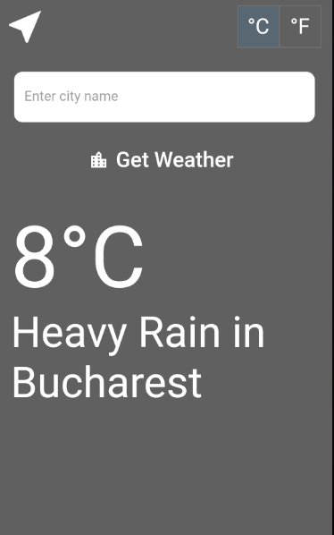

# metaweather_app

Simple app to get weather data from MetaWeather API.

## Features

### Usage

Top left button -> Refresh current location weather data;

Top right button -> Toggle between metric and imperial units;

TextField -> Enter city name for search;

'GetWeather' button -> Get weather data for the city entered above;

Info Section -> Degrees (C/F) + Weather State & City Name
